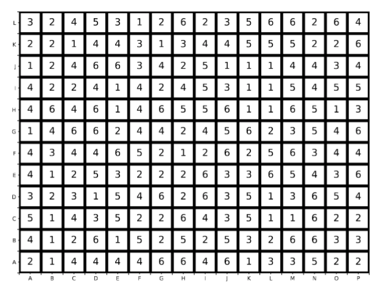

# Lesson Framework 

This page is for middle school teachers or subject experts doing outreach in informal settings such as after school programs. Prior knowledge of these computing concepts are not required. 

## Background: Parallel and Distributed Computing

Computers are everywhere. Smart phones for instance, are a lot smaller than they used to be because the computers inside them got a lot smaller as engineers improved their design. In recent years, however, we have reached the physical limitations of how small a computer can be before it starts to melt when it gets used. So now instead of trying to make computers more smaller and faster, engineers build supercomputers which essentially are a lot of computers that work together to solve a task.

Engineers might use supercomputers to simulate the aerodynamics of a fighter jet. Scientists use supercomputers to forecast the weather. Social scientists use supercomputers to analyse connections between users on Instagram. But using a supercomputer is not like using a desktop computer. Because supercomputers are made of of lot of smaller computers connected over a network, scientists have to learn how to break up their problem into smaller pieces and then integrate the results back into a larger picture. This lesson demonstrates why sometimes can be straight forward, and other times slows down the process to some degree.

## Learning Objective
Students will learn that it is faster to break down a large problem into smaller pieces and work in parallel to finish a task (parallelism). They will learn that when the task requires that they communicate with each other to complete it (distributed computing) that working together can be faster or slower depending how much time they spend communicating with each other (network). They will learn to balance these competing principles (optimization).

## Materials

This lesson only requires materials found in most classrooms including several matching sets of markers, crayons, or colored pencils. It also requires several pairs of scissors and tape dispensers. For a class of 30, you should need at least 15 pairs of markers, 4 pairs of scissors, and 4 tape dispensers. [Color-by-number grids](https://github.com/nicole-brewer/color-by-number) can be printed on regular 8.5 x 11, but they could also be constructed by a teacher if a printer was unavailable. 

## Instructions

1. Students can start the activity with a partner. Give each student a grid containing numbers, as shown below, and give each pair a timer (or let them use their phones) One student will color their grid by number. The other will be in charge of the timer and write down how long it takes for the other student to finish their grid. The idea of timing isn't compare students to their peers, but rather to future iterations of this experiment.

### Parallelism

2. Assessing student knowledge: students should break into groups of 4 - 6 students and discuss any pre-existing knowledge of related computer science terms such as serial, parallel, and distributed computing. Have one student from each group report to the class.

3. Give students a pair of scissors and a set of markers for each student. If you don't have enough marker sets to go around, groups can take turns timing each other. Let the students decide how to divide their grid among their group members. 

4. Think-pair-share: Ask the class a series of questions like “do you think it will take shorter or longer to finish the task when you can divide the work?”, “make a guess at how long it will take to complete the task when you can work together on it”, “does how you divide the work up change how quickly your group can complete the problem?”. A representative from each group can answer one of the questions.

5. Show them how to make markings on the back of the grid to indicate where the grid pieces should fit back together when they have each completed their sub-graph. Let them mark and cut the graph into sub-graphs. Then record how long it takes for each group to color all their grids and paste them back together.

### Distributed Computing

6. Color-by-formula: Pass out a new grid to each student. This time, instead of coloring the cell by the number in it, students will color cells based on surrounding values. Specifically, they should color the grid cell according to the following formula.

$$ center = left + down - right - up $$
For the first run, let students pair up as they did in step one and time each other on serial completions of the graph. This will give them some practice with the formula before moving on to the most complicated iteration of this lesson. 

6. Open-ended questions: Ask the students they think will happen when they try and split up the distributed task? What is different about this set of rules that changes the way they approach the problem? There are several correct answers, but if the class isn’t catching on, ask more pointed questions. Will splitting up the problem go faster or slower? Does the they divvy up the problem change how quickly they can complete it?

7. Distributed solution: Now let the students return to their groups. Let them divide their grid to their discretion as in the parallel case. Students again will work in parallel to finish the grid as quickly as possible. They will be able to complete the cells in the center just like when they practiced on their own but when they calculate the border, they will have to talk to their neighbor to obtain some of the numbers they need. Time each group to see how quickly they complete the task when working together, and compare this time to they made when working by themselves in step 3.

## Learning Outcomes

If students have achieved the above learning objective, their design for the distributed problem will be in the middle of a spectrum of two extremes: serial (one student assigned whole grid) and highly parallel (one student per grid square). When asked a series of open-ended questions about the design, they should be able to provide relevant motivations. That is, they should have a sense that both extremes are temporally costly, but that combining the two strategies takes advantage of parallelism but doesn’t require excess communication between sub-grids. If the students are extremely perceptive, they may suggest that this has to do with the proportion of shared-edge cells to total grid cells. 

